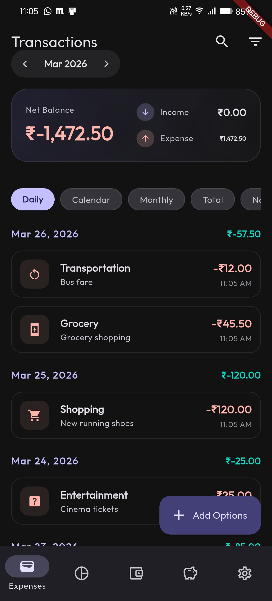
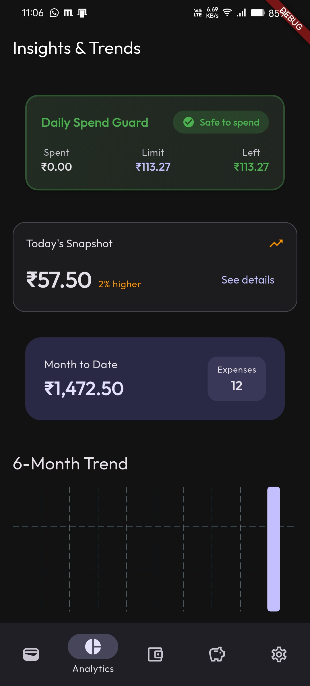
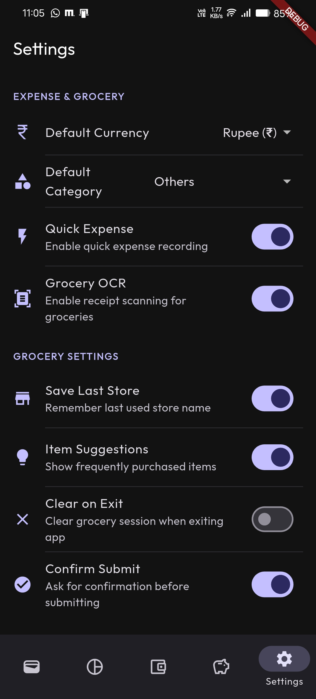

<p align="center">
  
</p>

<h1 align="center">Smart Expense Tracker</h1>

<p align="center">
  A production-ready, offline-first Flutter application for comprehensive personal finance management with clean architecture and intelligent features.
</p>

## 🚀 Overview
Smart Expense Tracker is a feature-rich mobile application that helps users track income, expenses, transfers, and analyze spending patterns. Built with Flutter and following clean architecture principles, it offers a unified transaction view, real-time spending protection, AI-powered insights, and receipt scanning capabilities.

## 📸 Screenshots (Updated, top-positioned)
This project includes locally bundled screenshots in `ss/` folder. Using top placement ensures visibility of the current UI state before feature details.

<table>
  <tr>
    <td></td>
    <td></td>
    <td></td>
  </tr>
  <tr>
    <td align="center">Transactions</td>
    <td align="center">Insights & Trends</td>
    <td align="center">Settings</td>
  </tr>
</table>

## ✨ Features

### 📱 Core Transaction Management
- **Unified Transactions**: Single chronological view combining income, expenses, and transfers
- **Multiple Views**: Five comprehensive perspectives:
  - **Daily View**: Chronological transactions grouped by date
  - **Calendar View**: Month grid with income/expense indicators
  - **Monthly View**: Year summary with expandable monthly breakdowns
  - **Total View**: Overall financial overview with budget status
  - **Notes View**: Transactions with notes only, grouped by date
- **Smart Filtering**: Instant filtering between All/Income/Expenses with segmented controls
- **Advanced Search**: Real-time search across categories, sources, and notes

### 🛡️ Daily Spend Guard
- **Real-time Protection**: Track daily spending against calculated limits
- **Smart Daily Limits**: Automatically calculated from monthly budget or 30-day average
- **Visual Status Indicators**: Color-coded status (Safe/Caution/Exceeded) for instant understanding
- **Automatic Updates**: Works automatically with existing budget and expenses

### 🧠 AI Spending Intelligence
- **Anomaly Detection**: Identifies unusual spending patterns using statistical Z-Score analysis
- **Budget Burn Prediction**: Predicts when budget limits will be reached based on current velocity
- **Category Dominance Insights**: Real-time insights into spending distribution
- **Daily AI Insights**: Background-generated personalized financial recommendations

### 🔍 OCR & Quick Entry
- **Receipt Scanning**: High-accuracy OCR powered by Google ML Kit to extract amounts and details
- **Quick Expense**: One-tap expense entry with last-used category memory
- **Grocery Sessions**: Dedicated mode for bulk-adding grocery items with real-time budget tracking
- **Smart Entry**: Unified transaction entry for expenses, income, and transfers

### 📊 Analytics & Visualization
- **Financial Analytics**: Comprehensive spending and income analytics
- **Interactive Charts**: Dynamic visualizations powered by `fl_chart`
- **Net Worth Tracking**: Account balance and financial trend monitoring
- **Budget Monitoring**: Real-time budget tracking with visual progress indicators

### ⚙️ Management & Security
- **Category Management**: Customizable expense and income categories
- **Budget Management**: Set and monitor monthly spending limits
- **Biometric Security**: FaceID/Fingerprint authentication for app protection
- **App Settings**: Customizable themes, currency, and notification preferences

### 🔄 Automation
- **Recurring Expenses**: Automated scheduled expense processing via background tasks
- **Daily Resets**: Automatic daily spending limit resets
- **Background Insights**: Automated AI insight generation in background

## 🧱 Architecture
The application follows **Clean Architecture** with clear separation of concerns:
- **Presentation Layer**: Widgets, Providers (Riverpod), Screens
- **Domain Layer**: Entities, Use Cases, Repository Interfaces
- **Data Layer**: Repository Implementations, Data Sources, Models

**Feature-based organization** with each feature containing its own presentation, domain, and data layers for maintainability and scalability.

## 📦 Tech Stack

### Core Framework
- **Flutter** (^3.10.4) - Cross-platform UI framework
- **Dart** - Programming language

### State Management & Architecture
- **Riverpod 3.x** - Reactive state management with code generation
- **Clean Architecture** - Layered architecture pattern
- **Freezed** - Immutable data classes with union types

### Data Persistence
- **Hive** - Fast NoSQL database for offline-first storage
- **Shared Preferences** - Lightweight key-value storage for settings

### Navigation & Routing
- **GoRouter** - Declarative routing with nested navigation
- **Stateful Shell** - Bottom navigation with persistent state

### UI & Design
- **Material Design 3** - Modern design system
- **fl_chart** - Interactive charting library
- **Google Fonts** - Typography customization
- **Flutter Animate** - Smooth animations and transitions

### AI & Machine Learning
- **Google ML Kit** - Text recognition for receipt scanning
- **Custom Algorithms** - Statistical analysis for spending intelligence

### Utilities & Services
- **Workmanager** - Background task scheduling
- **Local Auth** - Biometric authentication
- **Image Picker** - Camera and gallery access
- **Intl** - Internationalization and formatting
- **UUID** - Unique identifier generation

## 📁 Folder Structure

```text
lib/
├── core/                    # Shared utilities and infrastructure
│   ├── bootstrap/          # App initialization and dependency injection
│   ├── config/             # Environment-specific configuration
│   ├── constants/          # App constants, strings, colors
│   ├── domain/             # Core domain interfaces and use cases
│   ├── error/              # Error handling and failure types
│   ├── presentation/       # Shared UI components and screens
│   ├── router/             # App routing configuration
│   ├── services/           # Shared business logic services
│   ├── theme/              # App theming and styling
│   └── utils/              # Utility functions and extensions
│
├── features/               # Feature modules (Clean Architecture)
│   ├── transactions/       # Unified transaction management (default home)
│   ├── daily_spend_guard/  # Real-time daily spending protection
│   ├── expenses/           # Expense CRUD and recurring logic
│   ├── income/             # Income tracking and management
│   ├── spending_intelligence/ # AI insights and anomaly detection
│   ├── ocr/                # Receipt scanning with Google ML Kit
│   ├── grocery/            # Specialized bulk grocery entry
│   ├── analytics/          # Financial analytics and charts
│   ├── budget/             # Budget monitoring and alerts
│   ├── settings/           # App configuration and security
│   ├── smart_entry/        # Unified transaction entry
│   ├── quick_expense/      # Quick expense entry
│   ├── categories/         # Category management
│   ├── transfer/           # Transfer between accounts
│   └── accounts_overview/  # Net worth tracking
│
├── main.dart               # Default entry point
├── main_dev.dart           # Development entry point
├── main_staging.dart       # Staging entry point
└── main_prod.dart          # Production entry point
```

## ⚙️ Setup Instructions

### Prerequisites
- Flutter SDK (^3.10.4)
- Dart SDK
- Android Studio / Xcode (for emulator/simulator)
- Google ML Kit setup (for OCR functionality)

### Installation Steps

1. **Clone the repository**
   ```bash
   git clone https://github.com/dipakrana844/expense_app.git
   cd expense_app
   ```

2. **Install dependencies**
   ```bash
   flutter pub get
   ```

3. **Generate code (CRITICAL)**
   This project uses `freezed`, `hive`, and `riverpod_generator`. You MUST run the build runner:
   ```bash
   flutter pub run build_runner build --delete-conflicting-outputs
   ```

4. **Run the application**
   - **Development mode** (default):
     ```bash
     flutter run
     ```
   
   - **With specific flavor**:
     ```bash
     # Development
     flutter run --flavor dev -t lib/main_dev.dart --dart-define=ENV=dev
     
     # Staging
     flutter run --flavor staging -t lib/main_staging.dart --dart-define=ENV=staging
     
     # Production
     flutter run --flavor prod -t lib/main_prod.dart --dart-define=ENV=prod
     ```

### Building for Release

**Android APK:**
```bash
# Development
flutter build apk --flavor dev --target lib/main_dev.dart --dart-define=ENV=dev

# Staging
flutter build apk --flavor staging --target lib/main_staging.dart --dart-define=ENV=staging

# Production
flutter build apk --flavor prod --target lib/main_prod.dart --dart-define=ENV=prod
```

**iOS:**
```bash
flutter build ios --flavor dev --target lib/main_dev.dart --dart-define=ENV=dev
```

## 📌 Current Status

### ✅ Completed & Stable Features
- Unified transaction management with 5 view modes
- Daily spend guard with real-time protection
- Expense and income CRUD operations
- Category management
- Budget tracking and monitoring
- OCR receipt scanning (basic implementation)
- Grocery session mode
- Smart entry for unified transaction input
- Quick expense entry
- Updated and production-ready UI layout with refined positioning for transactions and insights widgets
- Transfer between accounts
- Financial analytics and charts
- Settings with biometric security
- Background tasks for recurring expenses
- AI spending intelligence (anomaly detection, budget prediction)
- Multi-environment support (dev/staging/prod)

### 🔄 In Progress / Planned Enhancements
- Enhanced OCR accuracy and additional data extraction
- Cloud sync and backup functionality
- Export/import data features
- Advanced reporting and PDF generation
- Multi-currency support
- Investment tracking integration

### 🛠️ Technical Implementation Status
- **Architecture**: Clean Architecture fully implemented
- **State Management**: Riverpod with code generation
- **Data Persistence**: Hive for offline-first storage
- **Testing**: Unit and integration tests for core services and features
- **CI/CD**: Manual builds (GitHub Actions pipeline planned)

## 🤝 Contributing
Contributions are welcome! Please feel free to submit a Pull Request.

1. Fork the repository
2. Create a feature branch (`git checkout -b feature/amazing-feature`)
3. Commit your changes (`git commit -m 'Add amazing feature'`)
4. Push to the branch (`git push origin feature/amazing-feature`)
5. Open a Pull Request

## 📄 License
This project is licensed under the MIT License - see the [LICENSE](LICENSE) file for details.

---

**Built with ❤️ using Flutter & Clean Architecture**
